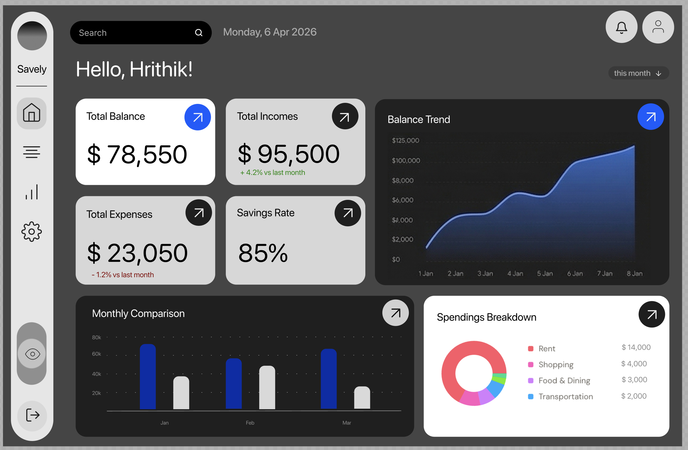

<div align="center">
  
  <br />
  <br />

  # ✦ Savely 
  **A Modern, Premium Financial Dashboard & Expense Tracker**

  <p align="center">
    
    
    
    
    
  </p>

  <p align="center">
    <a href="#-about-the-project">About</a> •
    <a href="#-key-features">Features</a> •
    <a href="#-tech-stack">Tech Stack</a> •
    <a href="#-getting-started">Getting Started</a> •
    <a href="#-architecture">Architecture</a>
  </p>
</div>

---

## 📖 About the Project

**Savely** is an interactive, frontend-focused financial dashboard designed to demonstrate enterprise-grade UI/UX principles, modern React architecture, and state management. 

Built with scalability in mind, it moves beyond standard CRUD operations by introducing complex interactive states like **Role-Based Access Control (RBAC)**, dynamic data visualizations, and an expansive settings hub tailored for a SaaS environment.

---

## ✨ Key Features

* **🛡️ Role-Based Access Control (RBAC):** Toggleable 'Editor' and 'Viewer' modes. The UI dynamically adapts, rendering or hiding action columns, edit controls, and creation modals based on the user's current global permission state.
* **📊 Data-Driven Insights:** Features native SVG-rendered Donut Charts and computed horizontal progress bars, all strictly typed and dynamically generated from mock transaction data.
* **⚡ High-Performance Tables:** Powered by `@tanstack/react-table`, the transactions view includes client-side pagination, real-time debounced search, multi-parameter filtering, and CSV export functionality.
* **⚙️ Smart Settings Hub:** A premium settings architecture featuring tabbed navigation, simulated AI-feature toggles, UI accent color mapping, and data portability controls (export/delete).
* **📱 Responsive & Accessible:** Built mobile-first with Tailwind CSS, featuring collapsible sidebars, custom scrollbars, and accessible contrasting color palettes.

---

## 🛠 Tech Stack

Savely is built using the modern React ecosystem:

* **Framework:** [React 18](https://react.dev/) + [Vite](https://vitejs.dev/)
* **Language:** [TypeScript](https://www.typescriptlang.org/) (Strict Mode)
* **Styling:** [Tailwind CSS](https://tailwindcss.com/)
* **Icons:** [Lucide React](https://lucide.dev/)
* **Data Grid:** [TanStack Table v8](https://tanstack.com/table/v8)
* **Deployment:** [Vercel](https://vercel.com/) (with SPA routing configuration)

---

## 🚀 Getting Started

To run this project locally, follow these steps:

### Prerequisites
* Node.js (v18 or higher recommended)
* npm or pnpm

### Installation

1. **Clone the repository**
   ```bash
   git clone [https://github.com/yourusername/savely.git](https://github.com/yourusername/savely.git)
   cd savely

2. **Install dependencies**

    ```bash
    npm install

3. **Start the development server**

    ```bash
    npm run dev

**Open your browser**

***Navigate to http://localhost:5173 to view the app.***
